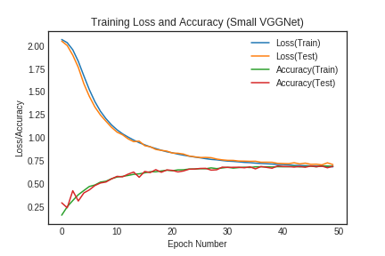
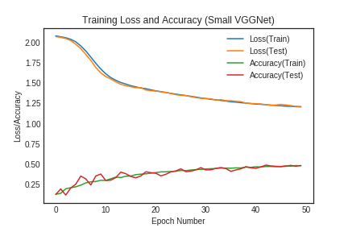
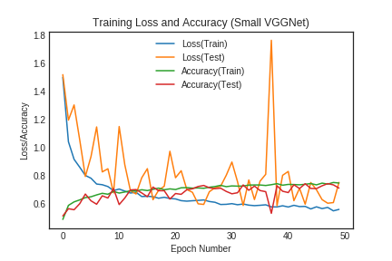
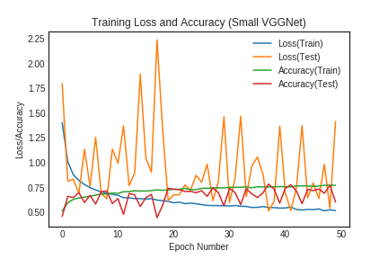
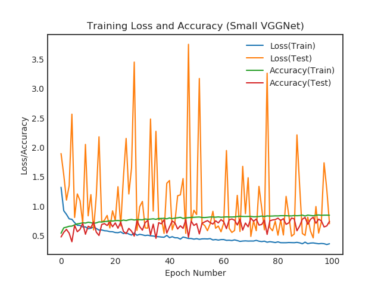
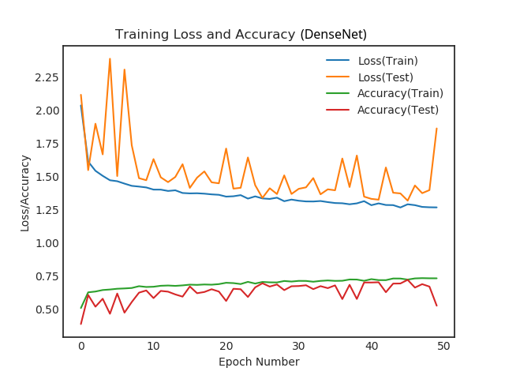
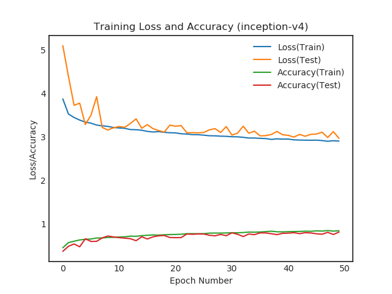

# KVASIR Dataset (Simple Neural Network)

Dataset Link: [KVASIR Dataset](https://datasets.simula.no/kvasir/data/kvasir-dataset-v2.zip)

## Simple Neural Network

### Simple Neural Network [Normal]

| PARAMETER            | VALUE |
|----------------------|-------|
| Image Resolution     | 32x32 |
| Test Data Percentage | 20%   |
| Augmented            | No    |
| Learning Rate        | 0.01  |
| Batch Size           | 32    |
| Number of Epochs     | 50    |
| Average Precision    | 71%   |
| Average Recall       | 70%   |

[IPython Notebook](SIMPLE_NN.ipynb)

### Simple Neural Network [Greyscaled]

| PARAMETER            | VALUE |
|----------------------|-------|
| Image Resolution     | 32x32 |
| Test Data Percentage | 20%   |
| Augmented            | No    |
| Learning Rate        | 0.01  |
| Batch Size           | 32    |
| Number of Epochs     | 50    |
| Average Precision    | 50%   |
| Average Recall       | 51%   |

[IPython Notebook](SIMPLE_NN_GREY.ipynb)

## Small VGGNet

### Small VGGNet [Normal]

| PARAMETER            | VALUE |
|----------------------|-------|
| Image Resolution     | 32x32 |
| Test Data Percentage | 20%   |
| Augmented            | Yes   |
| Learning Rate        | 0.01  |
| Batch Size           | 32    |
| Number of Epochs     | 50    |
| Average Precision    | 74%   |
| Average Recall       | 71%   |

[IPython Notebook](SMALL_VGGNET.ipynb)

### Small VGGNet [64x64 Images]

| PARAMETER            | VALUE |
|----------------------|-------|
| Image Resolution     | 64x64 |
| Test Data Percentage | 20%   |
| Augmented            | Yes   |
| Learning Rate        | 0.01  |
| Batch Size           | 32    |
| Number of Epochs     | 50    |
| Average Precision    | 73%   |
| Average Recall       | 60%   |

[IPython Notebook](SMALL_VGGNET_64.ipynb)

### Small VGGNet [128x128 Images]

| PARAMETER            | VALUE   |
|----------------------|---------|
| Image Resolution     | 128x128 |
| Test Data Percentage | 15%     |
| Augmented            | Yes     |
| Learning Rate        | 0.01    |
| Batch Size           | 64      |
| Number of Epochs     | 100     |
| Average Precision    | 79%     |
| Average Recall       | 74%     |

[Generated using python script.](https://asciinema.org/a/264475)

## DenseNet

[More Info](https://arxiv.org/abs/1608.06993)

[Densenet Keras Implementation](https://github.com/seasonyc/densenet)

| PARAMETER            | VALUE |
|----------------------|-------|
| Image Resolution     | 64x64 |
| Test Data Percentage | 15%   |
| Augmented            | Yes   |
| Learning Rate        | 0.01  |
| Batch Size           | 64    |
| Number of Epochs     | 50    |
| Average Precision    | 67%   |
| Average Recall       | 53%   |

### DenseNet  hyperparamerters

| PARAMETER            | VALUE |
|----------------------|-------|
| Dense Blocks         | 3     |
| Dense Layers         | 1     |
| Growth Rate          | 12    |
| Dropout Rate         | 20%   |
| Bottleneck           | No    |
| Compression          | 0.5   |
| Weight Decay         | 1e-4  |
| Depth                | 540   |

[Generated using python script.](https://asciinema.org/a/1EKyJpvnbESlkG0bVWAmCv96z)

## Inception V4

[More Info](https://arxiv.org/abs/1602.07261)

[Inception V4 Keras Implementation](https://github.com/kentsommer/keras-inceptionV4)

| PARAMETER            | VALUE   |
|----------------------|---------|
| Image Resolution     | 299x299 |
| Test Data Percentage | 15%     |
| Augmented            | Yes     |
| Learning Rate        | 0.01    |
| Batch Size           | 16      |
| Number of Epochs     | 50      |
| Average Precision    | 81%     |
| Average Recall       | 81%     |

### Inception V4 hyperparamerters

| PARAMETER            | VALUE |
|----------------------|-------|
| Dropout Probability  | 20%   |

Generated using python script.
